# 🌌 Omniverse OpenUSD Starter & 3D Web Studio

[](https://github.com/iliachry/omniverse-improv/actions/workflows/ci.yml)
[](https://github.com/iliachry/omniverse-improv/actions/workflows/deploy-pages.yml)
[](https://openusd.org/)
[](https://developer.nvidia.com/physx-sdk)
[](https://threejs.org/)
[](https://python.org)
[](https://opensource.org/licenses/MIT)

> A modern, end-to-end open-source toolkit and starter template for **NVIDIA Omniverse Kit**, **OpenUSD**, **BIM (Building Information Modeling)**, **Cesium Geospatial 3D Tiles**, **Isaac Sim Robotics**, and **Synthetic Data Generation (SDG)**. Includes a standalone in-browser **WebGL 3D Studio**, **Live PBR Shader Editor**, **Storey & Discipline BIM Inspector**, **PhysX Simulation Engine**, and **Apple USDZ / AR QuickLook Exporter**.

---

## 🌟 Architecture & Features Overview

```mermaid
graph TD
    A[Omniverse OpenUSD Starter] --> B[🖥️ In-Browser WebGL 3D Studio]
    A --> C[🚀 Native Omniverse Kit Extension]
    A --> D[🦾 Isaac Sim 6-DOF Robotics]
    A --> E[👁️ Replicator Synthetic Data SDG]
    A --> F[🏛️ BIM & Cesium Geospatial Digital Twins]
    A --> G[📦 Standalone USD & USDZ Tools]

    B --> B1[USD Stage Parser & Outliner]
    B --> B2[Live PBR Shader Editor & Color Pickers]
    B --> B3[Storey Isolation & Discipline Filter]
    B --> B4[24h Solar Shadow Study Simulator]
    B --> B5[In-Browser PhysX Dynamic Simulator]
    B --> B6[Export Modified .usda directly from Web]

    C --> C1[omni.ui Custom Dark-Mode Window]
    C --> C2[One-Click Studio Lighting & Ground Colliders]
    C --> C3[Procedural Kinetic Domino & Tower Spawners]
    C --> C4[Real-time Gravity Tweaker]

    D --> D1[6-DOF Industrial Manipulator Kuka/UR style]
    D --> D2[2-Finger Parallel Jaw Gripper]
    D --> D3[UsdPhysics.DriveAPI Joint Controllers]

    E --> E1[Multi-modal Domain Randomization]
    E --> E2[RGB + Depth + 2D/3D BBoxes + Semantic Masks]
    E --> E3[Interactive SDG Annotation Visualizer Web Dashboard]

    F --> F1[WGS84 Georeferencing CesiumGeoreference]
    F --> F2[IFC4 Semantic Hierarchy & Property Sets Psets]
    F --> F3[OGC 3D Tiles 1.0/1.1 tileset.json Exporter]

    G --> G1[Apple USDZ AR QuickLook Packager]
    G --> G2[Automated Pytest Suite 18/18 Passing]
```



---

## 🚀 Key Highlights

### 1. 🏛️ BIM & Cesium Geospatial Digital Twins (`usd_generators/`)
* **WGS84 Georeferencing**: Authors standards-compliant `CesiumGeoreference` prims and `CesiumGlobeAnchorAPI` schemas natively compatible with **Cesium for Omniverse**.
* **IFC4 Semantic Hierarchy (ISO 16739)**: Full structural decomposition into `IfcBuildingStorey`, `IfcColumn`, `IfcWallStandardCase`, `IfcCurtainWall`, `IfcSlab`, `IfcDuctSegment`, `IfcPipeSegment`, and `IfcSolarDevice`.
* **Discipline Separation & Psets**: Separate subsystems for **Structural** (concrete columns/slabs), **Architectural** (double-glazed facades, drywall, doors), and **MEP** (HVAC chillers, ductwork, fire sprinkler piping, bifacial solar PV array). Custom attributes under `bim:pset:*` (FireRating, ThermalTransmittance, ConcreteGrade, PeakPower).
* **OGC 3D Tiles Exporter (`export_3dtiles.py`)**: Exports `tileset.json` with WGS84 bounding regions `[west, south, east, north, min_h, max_h]` ready for **Cesium Ion** and **CesiumJS**.

### 2. 🌐 Interactive WebGL 3D Studio & BIM Inspector (`usd_viewer/`)
* **Zero-Install USD Preview**: Converts OpenUSD stages (`.usda`, `.usd`, `.usdc`) into Three.js scene graphs with real-time PBR shaders (diffuse, metallic, roughness, emissive glow, clearcoat, opacity).
* **Storey Isolation & Discipline Filters**: Isolate Ground, Lab L1, Offices L2, Rooftop, or All Floors with instant toggle buttons; filter Structural, Architectural, and MEP systems.
* **X-Ray Ghost Mode**: Make architectural walls and slabs 80% transparent to inspect hidden MEP ductwork and internal structural framing.
* **24-Hour Solar Study Simulator**: Real-time slider (06:00 to 20:00) dynamically computing solar altitude and azimuth based on building latitude, casting accurate real-time directional sunlight and shadows.
* **BIM Element Inspector**: Click any building element to inspect its IFC entity type, discipline, dimensions, and full property sets.
* **Live PBR Material Editor & USDA Exporter**: Live color pickers and roughness/metallic sliders in the browser with single-click export back to `.usda`.
* **⚡ In-Browser PhysX Simulation**: Live rigid-body dynamics (Cannon.js integration) with gravity presets (Earth, Moon, Jupiter, Zero-G) and kinetic kick triggers.

### 2. 🦾 6-DOF Industrial Robotics & Articulations (`robotics/`)
* **6-DOF Kinematic Chain**: Waist yaw ($\pm 180^\circ$), Shoulder pitch ($-60^\circ \to +90^\circ$), Elbow pitch ($-120^\circ \to +120^\circ$), Wrist roll, Wrist pitch, Tool flange yaw.
* **Parallel Jaw Gripper**: Linear prismatic joint drives for open/close gripping actions.
* **Dual Runtime**: Authors standards-compliant `UsdPhysics.ArticulationRootAPI` and `DriveAPI` for both offline USD pipelines and native **Isaac Sim** control loops.

### 3. 👁️ Replicator Synthetic Data (SDG) Visualizer (`replicator/`)
* **Multi-Modal Captures**: RGB images, 2D tight bounding boxes, 3D oriented bounding boxes, and pixel-wise semantic segmentation masks.
* **Interactive Dashboard**: Inspect captured frames side-by-side with toggleable bounding box tags, semantic segmentation mask alpha slider, and ground-truth JSON metadata.

### 4. 🍏 Apple USDZ & AR QuickLook Exporter (`usd_generators/export_usdz.py`)
* Packages `.usda` scenes into standalone Apple-compatible `.usdz` archives for instant preview on iPhones, iPads, and macOS.

### 5. 🛠️ Official Omniverse Kit Extension (`exts/omni.improv.starter/`)
* Modern dockable `omni.ui` studio extension for NVIDIA Kit 110+ with live hot-reloading, stage builders, and physics tweakers.

---

## ⚡ Quickstart Guide

### 1. In-Browser 3D Studio & SDG Dashboard
```bash
# 1. Clone the repository
git clone https://github.com/iliachry/omniverse-improv.git
cd omniverse-improv

# 2. Install lightweight dependencies
pip install -r requirements.txt

# 3. Launch the WebGL 3D Studio & SDG Dashboard
python usd_viewer/server.py
```
Open **`http://localhost:8088`** in any web browser!

---

### 2. Standalone OpenUSD Scene Generators
Generate high-fidelity `.usda` stages without needing Omniverse Kit or a GPU:
```bash
# 1. Generate 6-DOF Industrial Robot Arm + Parallel Gripper
python usd_generators/generate_robotics_arm.py

# 2. Run High-Precision 6-DOF Inverse Kinematics (IK) & Pick-and-Place Solver
python robotics/ik_solver.py

# 3. AI Natural Language Prompt-to-USD Scene Generator
python usd_generators/prompt_to_usd.py --prompt "Cyberpunk arena with 12 pillars and floating ruby crystal"

# 4. Generate Industrial Warehouse Digital Twin & Conveyor Simulation
python usd_generators/generate_warehouse_digital_twin.py

# 5. Generate Kinetic Domino Run & Physics Playground
python usd_generators/generate_physics_playground.py

# 6. Generate Procedural Sci-Fi Colonnade & Gem Dais
python usd_generators/generate_procedural_scene.py

# 7. Generate Destructible Jenga Block Tower
python usd_generators/generate_block_tower.py

# 8. Generate Georeferenced Smart Tech Campus BIM Facility
python usd_generators/generate_bim_cesium_stage.py --lat 37.9753 --lon 23.7361 --height 120.0

# 9. Export OGC 3D Tileset (tileset.json) for Cesium Ion / CesiumJS
python usd_generators/export_3dtiles.py --input usd_generators/output_bim_cesium.usda

# 10. Generate Synthetic Dataset & Export to YOLOv8 / COCO Training Formats
python replicator/generate_synthetic_dataset_standalone.py
python replicator/export_coco_yolo.py --format all
```

---

### 3. Apple USDZ AR Export
```bash
python usd_generators/export_usdz.py --input usd_generators/output_bim_cesium.usda
```

---

### 4. Launching Native NVIDIA Omniverse Kit Studio (RTX)
For systems with an NVIDIA RTX GPU, run the native desktop editor:
```powershell
.\launch_omniverse_editor.bat
```
Or open a specific stage directly:
```powershell
.\launch_omniverse_usd.bat usd_generators\output_bim_cesium.usda
```

---

## 🧪 Automated Testing

The codebase includes an automated unit test suite with 100% passing tests:

```bash
pytest tests/ -v
```

```text
tests/test_advanced_features.py::test_inverse_kinematics_convergence PASSED [  5%]
tests/test_advanced_features.py::test_pick_and_place_trajectory_generation PASSED [ 11%]
tests/test_advanced_features.py::test_prompt_to_usd_generator PASSED     [ 16%]
tests/test_advanced_features.py::test_warehouse_digital_twin_generator PASSED [ 22%]
tests/test_advanced_features.py::test_yolo_and_coco_dataset_exporter PASSED [ 27%]
tests/test_bim_cesium.py::test_bim_cesium_stage_generation PASSED        [ 33%]
tests/test_bim_cesium.py::test_bounding_region_math PASSED               [ 38%]
tests/test_bim_cesium.py::test_3dtiles_export PASSED                     [ 44%]
tests/test_bim_cesium.py::test_usd_parser_bim_cesium_extraction PASSED   [ 50%]
tests/test_extension_core.py::test_setup_studio_environment PASSED       [ 55%]
tests/test_extension_core.py::test_spawn_block_tower PASSED              [ 61%]
tests/test_extension_core.py::test_spawn_primitive_and_materials PASSED  [ 66%]
tests/test_extension_core.py::test_physics_helper_gravity_tweaker PASSED [ 72%]
tests/test_robotics_and_sdg.py::test_6dof_robotics_articulation_setup PASSED [ 77%]
tests/test_robotics_and_sdg.py::test_usdz_packaging PASSED               [ 83%]
tests/test_usd_generators.py::test_physics_playground_generation PASSED  [ 88%]
tests/test_usd_generators.py::test_procedural_scene_generation PASSED    [ 94%]
tests/test_usd_generators.py::test_usd_parser_serialization PASSED       [100%]
============================= 18 passed in 1.32s =============================
```

---

## 📁 Project Structure

```text
omniverse-improv/
├── .github/
│   └── workflows/
│       ├── ci.yml                    # Automated cross-platform pytest & USD validation
│       └── deploy-pages.yml          # Automated GitHub Pages web demo build
├── apps/
│   └── omni.improv.editor.kit        # Native Omniverse Kit application definition
├── exts/
│   └── omni.improv.starter/          # Official Omniverse Kit Extension
│       ├── config/extension.toml     # Manifest & dependencies
│       └── omni/improv/starter/
│           ├── extension.py          # omni.ext lifecycle hooks
│           ├── ui/main_window.py     # Dockable omni.ui window
│           └── core/stage_builder.py # Stage spawner & PBR material library
├── usd_generators/                   # Standalone OpenUSD Scene Builders
│   ├── generate_robotics_arm.py      # 6-DOF Industrial Robot Arm + Gripper
│   ├── generate_physics_playground.py# Domino chain reaction & ramps
│   ├── generate_procedural_scene.py  # Sci-Fi platform with emissive shaders
│   ├── generate_block_tower.py       # Jenga-style destructible block tower
│   └── export_usdz.py                # Apple USDZ / AR QuickLook packager
├── usd_viewer/                       # In-Browser WebGL 3D Studio & Simulator
│   ├── server.py                     # API server for stages & SDG datasets
│   ├── usd_parser.py                 # OpenUSD stage to JSON parser
│   ├── export_static_demo.py         # Static bundle builder for GitHub Pages
│   └── static/
│       ├── index.html                # 3D Studio & SDG visualizer UI
│       ├── style.css                 # Dark-mode NVIDIA aesthetic theme
│       └── viewer.js                 # Three.js PBR viewer & Cannon.js PhysX engine
├── replicator/                       # Synthetic Data Generation (SDG)
│   ├── generate_synthetic_dataset_standalone.py # Offline multi-modal SDG generator
│   └── synthetic_data_pipeline.py    # Omniverse Replicator domain randomization
├── robotics/
│   └── isaac_sim_sandbox.py          # 6-DOF Articulation & Revolute/Prismatic Drives
├── tests/                            # Automated Pytest Suite
└── docs/                             # Static WebGL 3D Studio build for GitHub Pages
```

---

## 🤝 Contributing

Contributions, feature suggestions, and pull requests are welcome!
1. Fork the Project.
2. Create your Feature Branch (`git checkout -b feat/AmazingFeature`).
3. Commit your Changes (`git commit -m 'feat: Add AmazingFeature'`).
4. Ensure all tests pass (`pytest tests/`).
5. Push to the Branch (`git push origin feat/AmazingFeature`).
6. Open a Pull Request.

---

## 📄 License

Distributed under the **MIT License**. See `LICENSE` for more information.
