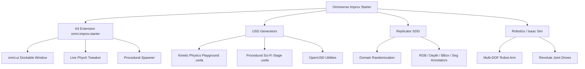

# 🌌 Omniverse Improv Starter

> A production-grade, modular developer starter template for **NVIDIA Omniverse**, **OpenUSD**, and **Isaac Sim**.

---

## 🌟 Overview

This repository provides a complete foundation for Omniverse development, covering:
1. **Omniverse Kit Extension (`exts/omni.improv.starter`)**: A full dockable `omni.ui` extension with live stage building, PhysX physics interaction, procedural generators, and PBR material binding.
2. **Procedural OpenUSD Generators (`usd_generators/`)**: Standalone Python pipelines for generating rich `.usda` and `.usd` stages (kinetic domino runs, ramps, sci-fi environments, studio lighting) without needing Omniverse Kit running.
3. **Synthetic Data Generation (`replicator/`)**: Omniverse Replicator (`rep`) workflow for domain randomization (lighting, poses, textures) and multi-modal dataset annotation (RGB, Depth, Bounding Boxes, Segmentation).
4. **Robotics Simulation (`robotics/`)**: Isaac Sim articulation setup with `UsdPhysics.DriveAPI` joint controllers and simulation loop.



---

## 📁 Repository Structure

```text
omniverse-improv/
├── .vscode/
│   ├── launch.json                   # VS Code launch configs (Kit attach, script debuggers)
│   └── settings.json                 # Python paths and USD file associations
├── requirements.txt                  # Standalone Python dependencies (usd-core, numpy)
├── pyproject.toml                    # Python project configuration
├── README.md                         # Project documentation
│
├── exts/
│   └── omni.improv.starter/          # Official Omniverse Kit Extension
│       ├── config/
│       │   └── extension.toml        # Extension manifest, versioning & dependencies
│       ├── docs/
│       │   └── README.md             # Extension documentation
│       └── omni/improv/starter/
│           ├── __init__.py           # Package entry point
│           ├── extension.py          # omni.ext.IExt lifecycle hooks & menu registration
│           ├── style.py              # Dark theme styling dictionary (NVIDIA palette)
│           ├── ui/
│           │   ├── main_window.py    # Dockable omni.ui window with collapsible panels
│           │   └── widgets.py        # Reusable omni.ui custom components
│           └── core/
│               ├── physics_helper.py # UsdPhysics & PhysX schema management
│               └── stage_builder.py  # Procedural stage spawner & PBR material library
│
├── usd_generators/                   # Standalone OpenUSD Authoring Scripts
│   ├── utils_usd.py                  # Common USD helpers (Stages, Lights, Materials, Ground)
│   ├── generate_physics_playground.py# Builds a kinetic domino & ramp physics stage (.usda)
│   └── generate_procedural_scene.py  # Builds a sci-fi dais with emissive rings & pillars (.usda)
│
├── replicator/                       # Synthetic Data Generation
│   └── synthetic_data_pipeline.py    # Omniverse Replicator domain randomization script
│
└── robotics/                         # Isaac Sim & Articulations
    └── isaac_sim_sandbox.py          # 2-DOF robot arm with joint drive controllers
```

---

## 🚀 Quickstart Guide

### 1. Standalone OpenUSD Generation (No Omniverse Kit Required)

You can generate standard OpenUSD stages immediately using any Python environment with `usd-core`:

```bash
# Install standalone USD requirements
pip install -r requirements.txt

# Generate Kinetic Physics Playground (.usda)
python usd_generators/generate_physics_playground.py

# Generate Procedural Sci-Fi Stage (.usda)
python usd_generators/generate_procedural_scene.py
```
> The generated `.usda` files can be opened in **Omniverse USD Composer**, **usdview**, **Blender**, or **Maya**.

---

### 2. Loading the Kit Extension in Omniverse

1. Launch **Omniverse USD Composer**, **Omniverse Code**, or **Isaac Sim**.
2. Open the Extension Manager: **Window > Extensions**.
3. Click the **Gear Icon (Settings)** at the top right of the Extension Manager.
4. Add the absolute path to the `exts` directory:
   ```text
   <path-to-repo>/omniverse-improv/exts
   ```
5. In the search box, search for **`Omniverse Improv Starter`** and enable the toggle switch.
6. The extension window will open automatically, or you can open it via the top menu: **Window > Improv Starter**.

---

### 3. Running the Synthetic Data Pipeline (Omniverse Replicator)

Run headless or inside Omniverse Kit / Isaac Sim:

```bash
# Using Omniverse Kit executable
<omniverse_dir>/kit/kit.exe --exec replicator/synthetic_data_pipeline.py
```
Outputs randomized image frames along with ground-truth 2D/3D bounding boxes, depth maps, and segmentation masks to `_sdg_output/`.

---

### 4. Running the Robotics Articulation Sandbox (Isaac Sim)

```bash
# Run using Isaac Sim Python environment
<isaac_sim_path>/python.bat robotics/isaac_sim_sandbox.py
```

---

## 🛠️ Omniverse Kit Extension Features

| Feature | Description |
| :--- | :--- |
| **🚀 Studio Setup** | One-click setup for `/World/PhysicsScene`, static ground collider, and studio lighting. |
| ** domino Run Spawner** | Generates an arced chain of dynamic dominoes and an elevated kinetic trigger sphere. |
| **🏰 Block Tower Spawner** | Stacks an 8-floor Jenga-style destructible wooden block tower. |
| **🔮 Kinetic Ball Shower** | Spawns 15 randomized bouncy neon spheres dropping from height. |
| **📦 Quick Spawner** | Spawns dynamic Cubes, Spheres, Cylinders, and Capsules with instant PBR shader binding. |
| **🎛️ Live Physics Controls** | Dynamically tweak gravity (Earth, Moon, Zero-G) and surface properties in real-time. |

---

## 🧑‍💻 Development & Debugging

- **Hot Reloading**: Kit extensions support live Python hot reloading. Any edits you make to Python files in `exts/omni.improv.starter/` will instantly update in the running Omniverse application without restarting.
- **VS Code Remote Debugging**:
  1. In Omniverse Kit, enable the `omni.kit.debug.python` extension.
  2. In VS Code, press `F5` or select **Omniverse: Attach to Kit (debugpy)** to set breakpoints and step through live extension code.

---

## 📄 License
MIT License. Free to use for personal, educational, and commercial Omniverse workflows.
